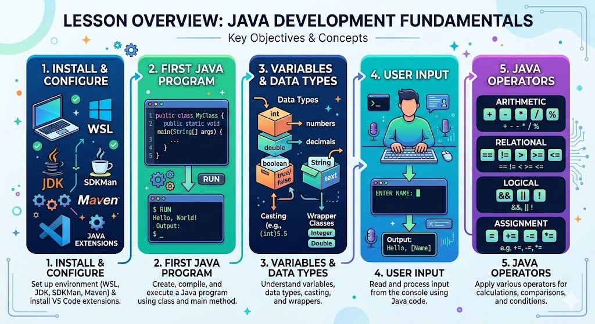

# 3.1 Programming Fundamentals and Control Structures (Part 1)

## Lesson Overview

## Dependencies
Refer to the following markdown file for the respective sections of the class:
- [Self Studies](./studies.md)
- [Lesson](./lesson.md)
- [Assignment](./assignment.md)

## Lesson Objectives
By the end of the lesson, you will be able to:
* **Install and configure** WSL, JDK 21, SDKMan, Maven, and VS Code Java extensions to set up a working Java development environment.
* **Write, compile, and run** Java programs using the `class` and `main` method.
* **Apply variables, data types, casting, and wrapper classes** to store and manipulate data in Java programs.
* **Read user input** from the console using the `Scanner` class.
* **Demonstrate usage of arithmetic, relational, logical, and assignment operators** in Java programs.

## Lesson Plan
| Duration | What                 | How or Why                                                              |
| -------- | -------------------- | ----------------------------------------------------------------------- |
| - 5mins  | Start zoom session   | So that learners can join early and start class on time.                |
| 10 mins  | Activity             | Recap on self-study and prework materials.                              |
| 45 mins  | Code-along           | Part 1: Installation of development environment (WSL, JDK, SDKMan, Maven, VS Code extensions). |
|          | **1 HR MARK**        |                                                                         |
| 10 mins  | Code-along           | Part 2: Class and main method.                                          |
| 10 mins  | Code-along           | Part 3: Compile and run Java programs.                                  |
| 30 mins  | Code-along           | Part 4: Variables and data types.                                       |
|          | **1 HR 50 MIN MARK** |                                                                         |
| 20 mins  | Code-along           | Part 5: Wrapper classes, boxing and unboxing.                           |
| 15 mins  | Code-along           | Part 6: Reading user input with Scanner.                                |
| 5 mins   | Break                |                                                                         |
|          | **2 HR 30 MIN MARK** |                                                                         |
| 30 mins  | Code-along           | Part 7: Operators (arithmetic, unary, assignment, relational, logical). |
| 5 mins   | Code-along           | Part 8: Useful tips.                                                    |
| 10 mins  | Summary / Q&A        | Summarize key takeaways and Q&A.                                        |
|          | **END CLASS 3 HR MARK** |                                                                      |