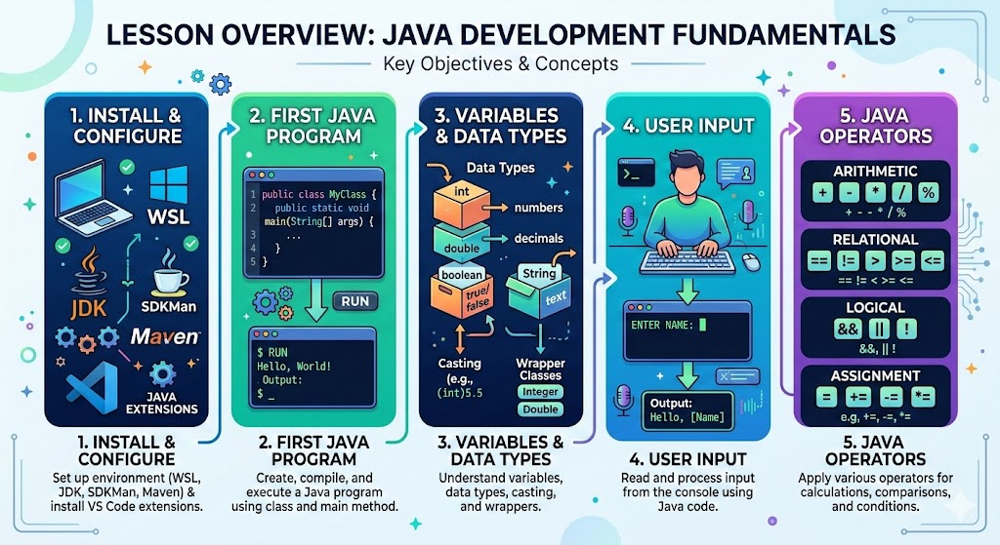

# 3.1 Programming Fundamentals and Control Structures (Part 1)

## Lesson Overview

## Dependencies
Refer to the following markdown file for the respective sections of the class:
- [Setup Guide](./setup.md) — **complete before class** (WSL, JDK 21, SDKMan, Maven, VS Code Java extensions)
- [Self Studies](./studies.md)
- [Lesson](./lesson.md)
- [Assignment](./assignment.md)

## Lesson Objectives
By the end of the lesson, you will be able to:
* **Write, compile, and run** Java programs using the `class` and `main` method.
* **Apply variables, data types, casting, and wrapper classes** to store and manipulate data in Java programs.
* **Read user input** from the console using the `Scanner` class.
* **Demonstrate usage of arithmetic, relational, logical, and assignment operators** in Java programs.

## Lesson Plan

**Prerequisite:** All installation and environment setup (WSL, JDK 21, SDKMan, Maven, VS Code Java extensions) is completed by students beforehand via `setup.md` — no installation time is required in class.

| Duration | What | How or Why |
| -------- | ---- | ---------- |
| - 5 mins | Start zoom session | So that learners can join early and start class on time. |
| 10 mins | Activity | Recap on self-study and prework materials. |
| 15 mins | Code-along | Part 2: `class` and `main` method (includes new Class and Object quick preview). |
| 10 mins | Code-along | Part 3: Compile and run Java programs. |
| 40 mins | Code-along | Part 4: Variables and data types. |
| | **1 HR 15 MIN MARK** | |
| 10 mins | Break | Short break 1. |
| 20 mins | Code-along | Part 5: Wrapper classes, boxing and unboxing. |
| 15 mins | Code-along | Part 6: Reading user input with Scanner. |
| | **2 HR MARK** | |
| 5 mins | Break | Short break 2. |
| 30 mins | Code-along | Part 7: Operators (arithmetic, unary, assignment, relational, logical). |
| 5 mins | Code-along | Part 8: Useful tips (code formatting). |
| | **2 HR 40 MIN MARK** | |
| 10 mins | Summary / Q&A | Summarize key takeaways and Q&A. |
| 10 mins | Exit ticket | Quick individual check for understanding before class ends. |
| | **END CLASS — 3 HR MARK** | |

**Delivery note:** Theory is taught from the slide deck; all code walkthroughs switch to `lesson.md`.

**Buffer:** Two short breaks total 15 minutes, built directly into the 3-hour clock above — no separate buffer needed elsewhere.